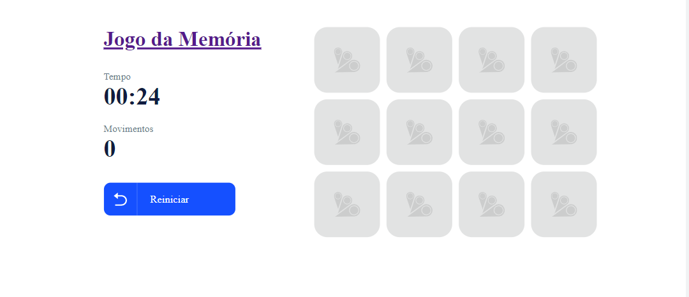

# Jogo da Memória

- Esse jogo foi criado com a tecnologia reactj
- No curso b7web.com.br

### Dentro do <b>README</b> da pasta do projeto está tudo que foi ou está sendo usando:

https://github.com/thiagoadssilva/ThiagoCalculandoImc/blob/main/frontend/README.md

## Projeto Publicado: http://imc.tfcoder.com/

## Imagem do projeto

